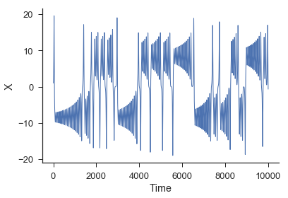
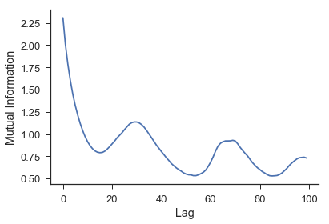
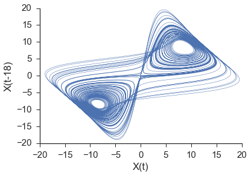

skNLF
========

This package is an implementation of nonlinear forecasting (NLF) using scikit-learn's style. It reconstructs [phase spaces][phase-space] to analyze behavior and make forecasts. The technique is described in depth in [Nonlinear Time Series Analysis by Kantz and Schreiber][nlf-book].

Quick Explanation
-----------------

skNLF looks for past configurations of the system that are similar to the present configuration of the system. It then looks at how the system evolved when it was in those similar configurations and uses that knowledge to make forecasts about future evolution. The forecasts are then compared to the actual evolution of the system.

Included Data
-------------

skNLF comes with one-dimensional and two-dimensional data.

The one dimensional data includes:

1. logistic_map : logistic equation
2. noisyPeriodic : sine and cosine wave added with noise
3. noisyPeriodic_complicated : more complicated sine and cosine wave
4. noise : randomly generated numbers
5. lorenz : lorenz equations

The two dimensional data includes:

1. chaos2D : 2D logistic map diffused in space
2. periodic : sine and cosine addition
3. periodicBrown : sine and cosine with brown noise added
4. brownNoise : brown noise generator
5. noise : randomly generated numbers
6. chaos3D : logistic map diffused in the third dimension
7. randomCircles : randomly placed circles
8. circleInCircle : circles sorrouned by larger circle
9. circlesWithStuff : larger circles with smaller circles around
10. randomSizedCircles : randomly sized circles spread around
11. voronoiMatrix : voronoi polygons

Functionality
-------------
skNLF can forecast both coninuous 1D time series, 2D spatio-temporal patterns, and 2D discrete spatial images. See the included notebooks for full examples.


Examples
--------
First, import skNLF and generate some data.
```python
import skNLF.data_gen as data
import skNLF.skNLF as nlf

X = data.lorenz()[:,0] #only the x values from the lorenz system
```



Next, we need to embed the time series. First the mutual information must be calculated in order to establish an appropriate lag.

```python
E = nlf.embed(X) #initiate the embed class
max_lag = 100
mi = E.mutual_information(max_lag)
```



Now we can embed the series using the appropriate lag and we can find the appropriate embedding dimension through a [false near neighbor test][false-nn] (not shown).

```python
lag = 18
embed = 3
predict = 36 #predicting out to double to lag
X,y = E.embed_vectors_1d(lag,embed,predict)
```


Now that the time series has been embedded, we can now do the nonlinear forecasting. First, however, it is split into a training set and a testing set so we can see how well the algorithm performs.

```python
max_nn = .1 * len(Xtrain) # test out to a maximum of 10% of possible NN
weights = 'distance' #use a distance weighting for the near neighbors

NLF = nlf.NonLin(max_nn,weights) # initiate the nonlinear forecasting class
NLF.fit(Xtrain,ytrain) #fit the training data
```

After it is fit, we then call the `dist_calc` method and the `predict` method to get our predictions. Next, we call the `score` method to see how well the algorithm performed.

```python
NLF.dist_calc(Xtest) #calculate the distance all the near neighbors
ypred = NLF.predict(10) #predictions using the 10 nearest neighbors
score = NLF.score(ytest) #score the predictions against the actual values
```


As we can see from the left plot above, the algorithm does well at low forecast distances, but the accuracy decreases as forecast distance increases. This is expected as the system is well known to be chaotic. The right plot shows the predictions for a forecast distance of 36. The algorithm is able to do relatively well at 'large' forecast distances.

For more examples check out the notebooks included with this repository.

[phase-space]: https://en.wikipedia.org/wiki/Phase_space)
[nlf-book]: http://www.amazon.com/Nonlinear-Time-Analysis-Holger-Kantz/dp/0521529026/ref=sr_1_8?ie=UTF8&qid=1452278686&sr=8-8&keywords=nonlinear+analysis
[nn-algo]: https://en.wikipedia.org/wiki/K-nearest_neighbors_algorithm
[sknn-algo]: http://scikit-learn.org/stable/modules/neighbors.html
[scikit]: http://scikit-learn.org/stable/
[false-nn]: http://www.mpipks-dresden.mpg.de/~tisean/TISEAN_2.1/docs/chaospaper/node9.html


